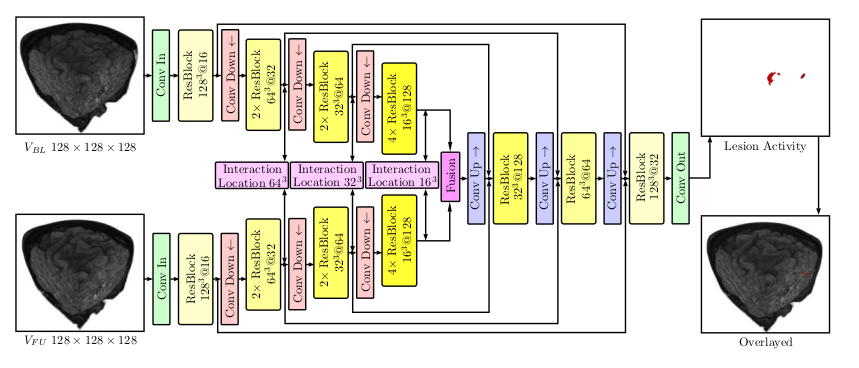

# Multiple Sclerosis Lesion Activity Segmentation with Two-Path CNNs
In this repository we have developed a model to detect new MS lesions based on the paper: *Multiple Sclerosis Lesion Activity Segmentation with Attention-Guided Two-Path CNNs* (https://www.sciencedirect.com/science/article/abs/pii/S0895611120300732). The model has been developed using python 3.8 and tensorflow 2.5.

The architecture of the model is well represented in the following image:  

The model takes the baseline and follow-up scans of size 128 x 128 x 128 and outputs the segmentation of the lesion activity between the 2 time-points.

## Structure
This repository contains the following files:
+ **preprocess.py:** This script contains all the functions that were necessary to create our tf.data.Dataset object, as well as the functions to augment our data.  
